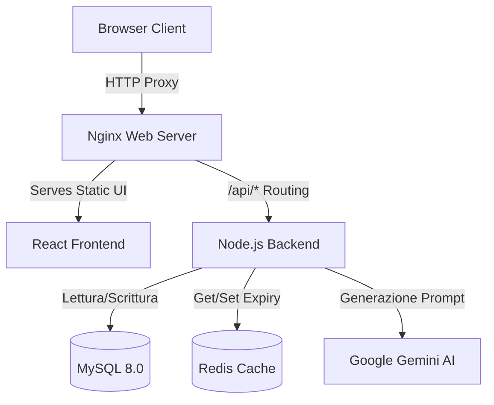

# Gestionale Finanziario: Sistema Intelligente di Tracciamento e Analisi

Sistema informativo web containerizzato per la gestione avanzata delle finanze personali, dotato di integrazione con Intelligenza Artificiale per l'auto-categorizzazione e la consulenza finanziaria. Progetto sviluppato per l'esame di Evoluzione del Software (UNIBA).

## Indice ReadMe

1. Visione del Progetto e Metodologia
2. Governance e Isolamento del Dato
3. Pilastri Tecnici e Sicurezza
4. Matrice di Sicurezza e Mitigazione
5. Architettura del Progetto
6. Stack Tecnologico
7. Modello Operativo
8. Funzionalità Operative del Sistema
9. Test d'Uso (Scenari Legittimi)
10. Test d'Abuso (System Stress Test)
11. Guida all'Installazione
12. Risoluzione Problemi (Troubleshooting)
13. Riferimenti Accademici

---

## 1. Visione del Progetto e Metodologia

Il Gestionale Finanziario è una piattaforma progettata per superare i limiti di una tradizionale applicazione CRUD monolitica. Il sistema adotta un'architettura a servizi containerizzati, orchestrata per garantire isolamento, scalabilità e manutenibilità.
Lo sviluppo ha seguito i principi della Software Evolution e metodologie DevOps-oriented, implementando pipeline di Continuous Integration (CI) e test automatizzati. L'obiettivo è dimostrare la transizione da un prototipo locale a un'infrastruttura "Production-Ready", dove i dati sensibili degli utenti sono rigorosamente segmentati e le performance sono ottimizzate tramite caching in-memory.

---

## 2. Governance e Isolamento del Dato

Questa sezione descrive i vincoli logici implementati per garantire la privacy finanziaria degli utenti e l'integrità del sistema.

### 2.1 Multi-tenancy Logico e Autenticazione

Il sistema adotta un modello di multi-tenancy logico dove i dati di molteplici utenti risiedono nello stesso database, ma sono crittograficamente inaccessibili tra loro.

* **Registrazione Sicura:** L'utente crea il proprio profilo fornendo email e password. Le credenziali vengono sottoposte ad hashing unidirezionale (Bcrypt) prima della persistenza.
* **Gestione Sessioni Stateless:** Non esistono sessioni persistenti lato server. L'autenticazione è delegata a token JWT (JSON Web Token) firmati con una chiave segreta, garantendo scalabilità orizzontale.
* **Segmentazione delle Risorse:** Ogni entità finanziaria (transazione) è matematicamente legata all'ID utente decodificato dal JWT. Nessun utente può interrogare o alterare le transazioni non associate al proprio identificativo.

### 2.2 Architettura dei Dati a Doppio Livello

Per bilanciare performance e costi di infrastruttura, il progetto adotta una gestione dei dati ibrida:

* **Persistenza Relazionale (Source of Truth):** I dati finanziari strutturati e le anagrafiche risiedono in un database MySQL isolato in un container dedicato.
* **Caching Volatile (Performance Layer):** I risultati delle aggregazioni finanziarie e dei consigli generati dall'Intelligenza Artificiale vengono memorizzati temporaneamente in Redis. Questo abbatte la latenza delle richieste ripetute e protegge l'infrastruttura da colli di bottiglia e consumi eccessivi delle API di Google Gemini.

---

## 3. Pilastri Tecnici e Sicurezza

Il backend non si fida implicitamente di alcuna richiesta proveniente dal client. Ogni operazione è soggetta a validazione tecnica.

### 3.1 "Never Trust, Always Verify"

Il sistema implementa un approccio di verifica continua tramite Express Middleware. Ogni chiamata agli endpoint `/api/transactions` o `/api/ai` viene intercettata dal middleware di autenticazione. Se l'header `Authorization: Bearer <token>` è assente, malformato o scaduto, la richiesta viene respinta istantaneamente (Status 401/403).

### 3.2 Isolamento dei Livelli (Layered Architecture)

Il codice applicativo è rigorosamente segmentato per separazione delle responsabilità:

* **Router Layer:** Definisce gli endpoint e inietta i middleware.
* **Controller Layer:** Estrae i parametri HTTP e gestisce le risposte JSON.
* **Service Layer:** Contiene la logica di business pura, ignara del contesto HTTP. Qui vengono costruite le query SQL parametrizzate.

### 3.3 Gestione Centralizzata degli Errori

Per prevenire "Information Disclosure" (rivelazione accidentale di dettagli infrastrutturali), il sistema adotta un `Global Error Handler`. Qualsiasi eccezione non gestita viene intercettata, loggata internamente e restituita al client come un messaggio JSON generico, privo di Stack Trace in ambiente di produzione.

---

## 4. Matrice di Sicurezza e Mitigazione

| Minaccia / Vulnerabilità | Implementazione Tecnica di Mitigazione |
| --- | --- |
| **BOLA (Broken Object Level Authorization)** | Controllo rigoroso dell'`user_id` nel Service Layer. Le query `UPDATE` e `DELETE` richiedono sia l'ID della transazione che l'ID utente estratto dal JWT protetto. |
| **SQL Injection** | Utilizzo esclusivo di Prepared Statements tramite la libreria `mysql2`. I parametri di input non sono mai concatenati direttamente nelle stringhe SQL. |
| **Compromissione Credenziali (Password)** | Hashing automatico tramite `bcryptjs` con Salt generation a 10 round. Le password in chiaro non sono mai allocate in memoria o nei log. |
| **CORS Attacks** | Intercettatore configurato rigorosamente. Il backend accetta richieste HTTP solo dalle origini (URL) dichiarate nelle variabili d'ambiente. |
| **API Rate Abuse / Gemini Quota Exhaustion** | Livello di Caching dinamico in Redis. I consigli AI e le liste di transazioni vengono servite dalla memoria per evitare il flooding verso i servizi esterni o il DB. |

---

## 5. Architettura del Progetto

Il sistema è strutturato su un modello a microservizi containerizzati, orchestrati tramite `docker-compose`.



### 5.1 Albero delle Directory

L'organizzazione del sorgente rispetta il principio di modularità:

```text
GESTIONALE_FINANZE/
├── frontend/                 # [SPA] Interfaccia Utente React/Vite
│   ├── src/                  # Componenti, App.jsx, Logica UI
│   ├── nginx.conf            # Configurazione Proxy e Web Server
│   └── Dockerfile            # Multi-stage build per la UI
├── backend/                  # [API] Core Logico Node.js
│   ├── controllers/          # Gestori delle richieste HTTP
│   ├── middleware/           # Filtri Auth, Cache, Error Handler
│   ├── routes/               # Mappatura Endpoint
│   ├── services/             # Logica di Business e Query Builder
│   ├── tests/                # Suite di Test Jest (Unit/Integration)
│   ├── db/                   # Inizializzazione SQL e Connection Pool
│   └── Dockerfile            # Containerizzazione Node.js
├── .github/workflows/        # Pipeline CI per automazione test
└── docker-compose.yml        # Orchestratore generale

```

---

## 6. Stack Tecnologico

| Componente | Tecnologia | Ruolo |
| --- | --- | --- |
| **Backend** | Node.js 20, Express 5 | Resource Server, Business Logic, API RESTful. |
| **Frontend** | React 18, Vite, Recharts | Interfaccia Utente reattiva, visualizzazione dati e grafici. |
| **Database** | MySQL 8.0 | Persistenza dati relazionali (Utenti, Transazioni). |
| **Caching** | Redis 7 | Archiviazione temporanea ad alte prestazioni. |
| **Intelligenza Artificiale** | Google Gemini 2.5 Flash | Analisi semantica descrizioni e consulenza finanziaria. |
| **Test & CI** | Jest, Supertest, GitHub Actions | Testing automatico del codice offline e validazione push. |
| **Orchestrazione** | Docker, Docker Compose | Containerizzazione e standardizzazione ambienti. |

---

## 7. Modello Operativo

Il sistema è progettato per il singolo operatore privato (Utente Standard). Ogni utente agisce all'interno di un perimetro operativo isolato:

* Ha visibilità esclusiva della propria dashboard finanziaria.
* Interagisce con l'Intelligenza Artificiale, la quale opera *esclusivamente* sul dataset transazionale di quell'utente specifico per generare consigli.
* Non possiede privilegi amministrativi globali.

---

## 8. Funzionalità Operative del Sistema

* **Tracciamento Transazionale:** Inserimento, modifica e cancellazione di entrate e uscite finanziarie.
* **Dashboard Analitica:** Visualizzazione grafica (tramite Recharts) dell'andamento finanziario, incidenza delle categorie di spesa e bilancio complessivo.
* **Esportazione Dati:** Generazione e download dei report finanziari in formato strutturato (CSV).
* **Auto-Categorizzazione IA:** Inserendo una descrizione generica (es. "Spesa al supermercato"), il sistema interroga il modello Gemini per associare automaticamente la categoria più corretta (es. "Cibo").
* **AI Financial Advisor:** Analisi contestuale dell'intero portfolio dell'utente. L'IA genera un report discorsivo analizzando i tassi di risparmio e identificando anomalie o eccessi in specifiche categorie di spesa.

---

## 9. Test d'Uso (Scenari Legittimi)

Scenari operativi consentiti ("Happy Path") per validare le funzionalità core:

1. **Registrazione e Accesso:** L'utente inserisce i propri dati e accede alla piattaforma. Il backend rilascia il token JWT che abilita l'interfaccia.
2. **Inserimento Guidato IA:** L'utente inserisce "Bolletta luce" e preme il pulsante Magia (IA). Il sistema pre-imposta "Uscita" e la categoria "Altro" o "Affitto/Utenze", dopodiché l'utente salva.
3. **Filtraggio Dati:** L'utente seleziona un mese specifico o una categoria dalla barra superiore. La tabella e i grafici a torta si aggiornano reattivamente mostrando solo il segmento selezionato.
4. **Richiesta Consiglio:** L'utente clicca su "Genera Analisi". Il sistema compila le statistiche finanziarie anonimizzate, interroga Gemini e formatta i suggerimenti a schermo tramite un parser Markdown integrato nel frontend.

---

## 10. Test d'Abuso (System Stress Test)

Tentativi deliberati di violazione dei vincoli ("Negative Testing") per dimostrare la resilienza dell'infrastruttura.

1. **Manipolazione ID Transazione (IDOR/BOLA):**
* *Azione:* L'Utente A tenta una richiesta `DELETE /api/transactions/15` dove l'ID `15` appartiene all'Utente B.
* *Risultato:* L'API risponde con errore `404/403` (Transazione non trovata o non autorizzata). Il `Transaction Service` applica la condizione vincolante `WHERE id = ? AND user_id = ?`, neutralizzando l'attacco silenziamente.


2. **Bypass Accesso API (Direct Request):**
* *Azione:* Richiesta diretta tramite terminale (cURL) a `/api/ai/advice` omettendo il token JWT.
* *Risultato:* Risposta immediata `401 Unauthorized`. Il Controller dell'IA non viene mai inizializzato grazie al blocco del middleware di sicurezza.


3. **Invalidazione Dati in Ingresso:**
* *Azione:* Invio di una richiesta di `categorize` (IA) fornendo un payload vuoto o senza la voce `description`.
* *Risultato:* Risposta `400 Bad Request`. Il controller verifica la validità formale della richiesta prima di consumare chiamate di rete esterne.


---

## 11. Guida all'Installazione

**Prerequisiti:** Docker e Docker Compose installati sul sistema target.
**Setup Rapido:**

1. Clonare il repository.
2. Configurare i file di ambiente:
* Navigare in `backend/` e copiare `.env.example` in `.env`.
* Inserire la chiave API valida nella variabile `GEMINI_API_KEY`.
* Creare il file `frontend/.env` e impostare `VITE_API_URL=/api`.


3. Avviare l'orchestrazione infrastrutturale:
```bash
docker-compose up --build -d

```


4. Il sistema sarà accessibile all'indirizzo `http://localhost:80`. I servizi sottostanti (MySQL, Redis, Backend Node) opereranno nelle rispettive reti virtuali chiuse.

---

## 12. Risoluzione Problemi (Troubleshooting)

| Sintomo | Causa Probabile | Soluzione |
| --- | --- | --- |
| **"Caricamento dati..." perpetuo nel Frontend** | Il database MySQL non è ancora pronto o il container Node si è fermato per un errore di connessione. | Eseguire `docker logs finance_backend` per verificare gli errori. Attendere 30 secondi all'avvio affinché il DB accetti connessioni. |
| **Errore 500 sulla categorizzazione IA** | La variabile `GEMINI_API_KEY` è vuota, invalida, o è stato superato il limite di chiamate. | Verificare il file `.env` nel backend e riavviare il container `docker-compose restart backend`. |
| **Modifiche al codice Frontend non visibili** | I file statici in produzione sono inseriti direttamente nell'immagine Nginx. | L'ambiente dockerizzato è pensato per la produzione. Per sviluppare attivamente, eseguire `npm run dev` nella cartella frontend in locale. |
| **Redis: Dati obsoleti visualizzati** | Errore nell'invalidazione dinamica della cache dopo una modifica manuale al DB. | Premere il tasto di logout e rientrare, oppure riavviare il container della cache: `docker restart finance_redis`. |

---

## 13. Riferimenti Accademici

* **Materiale Didattico:** Slide e riferimenti teorici del corso di Evoluzione del Software del professor Giulio Mallardi (ITPS, Università degli Studi di Bari Aldo Moro).
* **Architettura del Software:** Pattern MVC decostruito (Headless Backend + SPA Frontend).
* **Cloud & DevOps:** Immutabilità dell'infrastruttura mediante standardizzazione OCI (Docker Containers).
* **Principi SOLID:** Applicazione del *Single Responsibility Principle* tramite middleware dedicati e separazione dei servizi.
